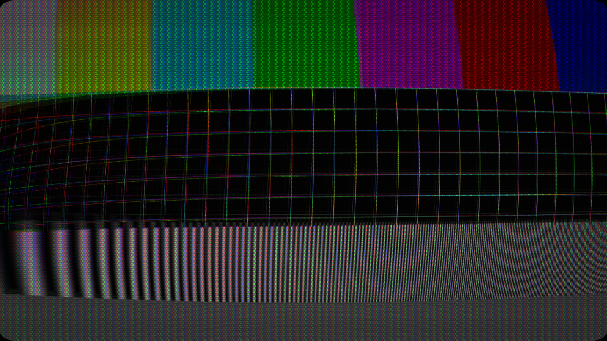

# (re)gauss

> **AI-assisted project.** This codebase was created with [Claude](https://claude.com/claude-code)
> (Anthropic), directed and reviewed by a human author. The physics is verified
> numerically by an offline harness that drives the real plugin class in a
> headless GL context: the GLSL field is compared against the C++ field it is
> supposed to mirror, the purity model is checked for identity at rest and a
> clean rotation at one phosphor, and the degauss coil is checked to actually
> demagnetise the mask and let it recover (see [Status](#status)). It has
> **never been loaded into Resolume or Resolve** — only compiled, rendered and
> measured offline. Check it in your own rig before trusting it in a show.

Electromagnetic interference on a CRT, and the coil that clears it, as an FFGL
effect for [Resolume](https://resolume.com) Arena and Avenue — and the same
thing again as an OpenFX plugin for Resolve, Nuke, Natron and Vegas.

**Video:** [What it does, in 40 seconds](https://www.youtube.com/watch?v=p3-tEdHAAlc)



<sub>Half a second into a degauss. The coil has pulled the HT down, so the
picture has dimmed and *swelled* — slower electrons are bent further by the same
yoke current. Rendered by `rgtest`, the offline harness.</sub>

## The idea

A colour CRT paints its picture by steering three electron beams with a magnetic
field. Put another magnetic field anywhere near it and the beams go somewhere
else.

That is the whole plugin: **one vector field over the tube's face, read once per
gun.** Three things everybody recognises fall out of it, and none of them is
drawn:

- **The picture leans and bulges** — the field's strength.
- **Every edge grows coloured fringes** — the field's *gradient*. The three
  cathodes sit in different places, so the three beams fly different paths and
  see different fields. A uniform field displaces all three equally and fringes
  nothing, which is exactly what the Earth's field does to a set somebody has
  turned to face a different wall. A fridge magnet on the glass fringes savagely.
- **Whole regions turn the wrong colour** — the field measured in shadow-mask
  pitches. Displace a beam by one whole phosphor width and the gun meant for the
  red stripe lands squarely on the green one. That is why a magnetised corner
  goes green rather than merely dim.

## The button

**Degauss** is not an animation played over the top. It fires a decaying
alternating field — a real automatic degausser is a coil in series with a PTC
thermistor, which is why the field dies away over a second or two rather than
switching off — and the mask's own magnetisation is walked down by *the same
envelope*. The decay is not decoration: demagnetising works because the applied
field passes through every amplitude on its way to zero.

So pressing it genuinely clears the state the plugin has accumulated. The picture
is thrown about, dims and swells while the coil loads the HT, and then the set is
clean until it magnetises again over the **Recovery** time. That loop —
stain builds, degauss, clean, stain builds — is the reason it is a performance
tool and not a filter.

It can also fire itself: on an **interval**, or on the **beat** or the **bar** of
Resolume's transport.

## Audio

The default layout is *Speaker Left* — an unshielded speaker beside the set.
A speaker's stray field is not *like* the audio signal; it **is** the audio
signal, because the voice coil current is the music and the magnet assembly
leaks it.

So the audio does not drive a new effect. It drives the field that was already
there, and everything downstream of the field — the lean, the fringing, the
colour stain — follows on its own. **Band** is worded as which driver in the
cabinet is leaking, because that is what it is: a woofer leaks the bass, a
tweeter the treble.

| Control | |
| --- | --- |
| **Audio Drive** | How much the signal adds to the field. Zero by default, so nothing twitches until audio is routed. |
| **Band** | Full Range, Woofer, Mid, Tweeter. |
| **Release** | How fast the field falls back after a peak. Instant attack, 20 ms to 1.5 s release. |
| **Trigger Coil** | Fire the degauss on a transient, with a **Threshold**. |

One consequence worth knowing, and it is the physics rather than a limitation:
**degaussing does not stop the audio stain.** The coil clears what the mask has
*stored*; it does nothing about the speaker still sitting there playing the
record. Degauss during a loud passage and the stain comes straight back.

FFGL only — an OFX host delivers no spectrum, so the OpenFX build simply does
not offer the group.

## Stacking on old-cathode

Set **Render** to *Interference Only* and (re)gauss applies the magnet and the
coil with no television of its own — for layering over
[old-cathode](https://github.com/stoatworks-labs/old-cathode) or over somebody's
real CRT footage. Two shadow masks in a chain is a moiré generator and two sets
of curvature is a fisheye.

Purity still works in that mode: it uses the mask pitch as an *implied* scale
rather than a drawn one, so the colour stain comes out the right size over
whatever tube is underneath.

## Controls

| Group | What it does |
| --- | --- |
| **Render** | Full CRT, or Interference Only for stacking. |
| **Field** | Where the magnets are (Layout, Seed), how strongly the mask holds it (Magnetisation), whether they move (Wander), and any alternating field leaking in from the room (Interference, Frequency). |
| **Beam** | The two sensitivities — Deflection for the geometry error, Purity for the colour error — plus Convergence (how far apart the three cathodes sit) and Overscan. |
| **Degauss** | The button, the Auto schedule, and what the coil does: Duration, Intensity, Coil Sag, Recovery. |
| **Tube** | Mask Pattern and Pitch, Scanlines, Line Count, Beam Bloom, Persistence, Halation, Brightness, Contrast. |
| **Geometry** | Curvature, Corner Radius, Perspective, Zoom, Vignette. |
| **Audio** | Audio Drive, Band, Release, and an optional coil trigger. See [Audio](#audio). |

**Deflection and Purity are separate on purpose.** On a real tube, how far a
field bends the beam is set by the yoke and the anode voltage; how much colour
error that bend causes is set by the mask pitch and the gun-to-mask distance.
Different hardware — and their real ratio means a magnet far too weak to move the
geometry visibly will still rotate the colours completely. That is the commonest
real purity fault there is, and one control derived from the other could not
reach it.

Eight factory presets, from *Speaker Beside It* through *Mains Hum* to *Degauss
on the Bar*.

<!-- downloads:start -->

## Download

**[v0.1.0](https://github.com/stoatworks-labs/regauss/releases/tag/v0.1.0)** — prebuilt for macOS and Windows. Pick your platform:

<details>
<summary><b>macOS</b> — Universal (Apple Silicon + Intel)</summary>

| Build | Download | Size |
| --- | --- | --- |
| Universal (Apple Silicon + Intel) · .dmg disk image | [`regauss-0.1.0-macos-universal.dmg`](https://github.com/stoatworks-labs/regauss/releases/download/v0.1.0/regauss-0.1.0-macos-universal.dmg) | 233 KB |
| Universal (Apple Silicon + Intel) · .zip archive | [`regauss-macos-universal.zip`](https://github.com/stoatworks-labs/regauss/releases/latest/download/regauss-macos-universal.zip) | 186 KB |
| Universal (Apple Silicon + Intel) · .zip archive (OpenFX — Resolve, Vegas, Nuke) | [`regauss-ofx-macos-universal.zip`](https://github.com/stoatworks-labs/regauss/releases/latest/download/regauss-ofx-macos-universal.zip) | 267 KB |

</details>

<details>
<summary><b>Windows</b> — x64</summary>

| Build | Download | Size |
| --- | --- | --- |
| x64 · .exe installer | [`regauss-0.1.0-windows-x86_64-setup.exe`](https://github.com/stoatworks-labs/regauss/releases/download/v0.1.0/regauss-0.1.0-windows-x86_64-setup.exe) | 222 KB |
| x64 · .zip archive | [`regauss-windows-x86_64.zip`](https://github.com/stoatworks-labs/regauss/releases/latest/download/regauss-windows-x86_64.zip) | 115 KB |
| x64 · .zip archive (OpenFX — Resolve, Vegas, Nuke) | [`regauss-ofx-windows-x86_64.zip`](https://github.com/stoatworks-labs/regauss/releases/latest/download/regauss-ofx-windows-x86_64.zip) | 70 KB |

</details>

All builds, checksums and release notes: [github.com/stoatworks-labs/regauss/releases](https://github.com/stoatworks-labs/regauss/releases).

macOS builds are signed and notarised and open normally. The Windows builds are unsigned, so SmartScreen warns once.

<!-- downloads:end -->

## Building

```bash
git clone --recursive https://github.com/stoatworks-labs/regauss
cd regauss
cmake -B build -DCMAKE_BUILD_TYPE=Release
cmake --build build
cmake --install build     # into ~/Documents/Resolume Arena/Extra Effects
```

The OpenFX bundle is built alongside as `build/Regauss.ofx.bundle`; copy it into
`/Library/OFX/Plugins` for Resolve. `-DBUILD_OFX=OFF` skips it.

See [`CLAUDE.md`](CLAUDE.md) for the full command reference and
[`AGENTS.md`](AGENTS.md) for the mental model and the traps.
First run on macOS or Windows: [`docs/UNSIGNED.md`](docs/UNSIGNED.md).

## Status

Run `tools/verify.sh`. What it establishes:

- The GLSL field matches the C++ field to under 1e-6 relative across all five
  layouts, including seeded and drifting ones. The probe is assembled from *the
  same strings* the beam pass uses, so it is not checking a copy.
- The purity model is the identity at zero field, rotates cleanly at one whole
  phosphor, wraps at a full triad, conserves light from −3 to +3 phosphors,
  produces no purity error on a maskless tube, and produces no *vertical* purity
  error on an aperture grille.
- The coil peaks at the moment of firing, is down to one per cent after exactly
  the stated Duration, decreases monotonically throughout, and lets the HT
  recover faster than the field. The whole loop runs: magnetisation 1.0 → 0.09 at
  0.77 s after the button → back to 1.0 over the Recovery time.
- All 40 parameters change the picture.
- Each mask gain is within 0.4% of the unmasked reference.
- The audio path carries a synthetic spectrum end to end: the field pumps with
  the injected bass, the four bands read different levels from it, and the coil
  re-arms and fires per kick rather than once.

**What is not established:** it has never been loaded into Resolume or Resolve.
The OpenFX bundle loads and renders under `ofxprobe`, which is not Resolve. The
Degauss button assumes Resolume draws an `FF_TYPE_EVENT` as a button and sends
one rising edge per press; Beat and Bar assume a real transport. The audio path
has only ever seen `rgtest`'s synthetic spectrum, never Resolume's FFT. The
macOS build is universal and verified with `lipo`; nothing has been built on
Windows or Linux.

## Licence

MIT — see [LICENSE](LICENSE). Third-party components are listed in
[ATTRIBUTIONS.md](ATTRIBUTIONS.md).
